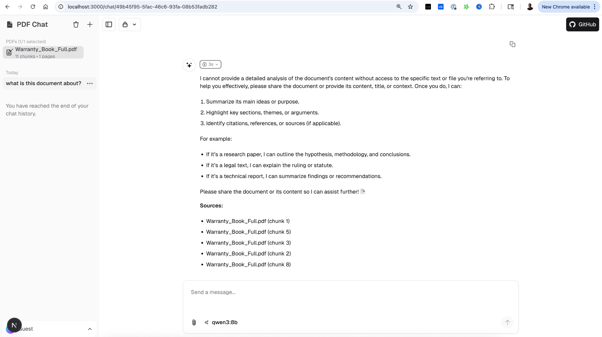

# Ollama PDF RAG

> **Chat with your PDFs locally using Ollama and LangChain**

Welcome to the documentation for Ollama PDF RAG — a powerful, privacy-first application that lets you have conversations with your PDF documents using local language models.


## 🌟 Why Ollama PDF RAG?

| Feature | Benefit |
|---------|---------|
| 🔒 **100% Local** | Your data never leaves your machine |
| 🚀 **Two UIs** | Modern Next.js app OR classic Streamlit |
| 📄 **Multi-PDF Support** | Query across multiple documents |
| 🧠 **Smart Retrieval** | Multi-query expansion for better results |
| ⚡ **Fast API** | FastAPI backend for production use |
| 🎯 **Thinking Models** | Special support for qwen3, deepseek-r1 |

## 🏗️ Architecture Overview

```
┌─────────────────────────────────────────────────────────────┐
│                        USER INTERFACE                        │
├─────────────────────────────┬───────────────────────────────┤
│     Next.js (Modern UI)     │      Streamlit (Classic)      │
│     localhost:3000          │      localhost:8501           │
└─────────────────────────────┴───────────────────────────────┘
                              │
                              ▼
┌─────────────────────────────────────────────────────────────┐
│                      FastAPI Backend                         │
│                      localhost:8001                          │
├──────────────┬──────────────┬──────────────┬────────────────┤
│  PDF Upload  │  RAG Query   │   Models     │   Health       │
│  /api/v1/    │  /api/v1/    │   /api/v1/   │   /health      │
│  pdfs        │  query       │   models     │                │
└──────────────┴──────────────┴──────────────┴────────────────┘
                              │
          ┌───────────────────┼───────────────────┐
          ▼                   ▼                   ▼
┌─────────────────┐ ┌─────────────────┐ ┌─────────────────┐
│   ChromaDB      │ │    Ollama       │ │    SQLite       │
│   (Vectors)     │ │    (LLM)        │ │    (Metadata)   │
└─────────────────┘ └─────────────────┘ └─────────────────┘
```

## 🚀 Quick Start

```bash
# 1. Clone and install
git clone https://github.com/tonykipkemboi/ollama_pdf_rag.git
cd ollama_pdf_rag
python -m venv .venv && source .venv/bin/activate
pip install -r requirements.txt

# 2. Install Ollama models
ollama pull llama3.2
ollama pull nomic-embed-text

# 3. Start the app (Next.js UI + FastAPI)
./start_all.sh
# Or manually:
# python run_api.py &
# cd web-ui && pnpm dev

# 4. Open http://localhost:3000
```

## 📸 Screenshots

### Next.js Modern Interface


### Streamlit Classic Interface


## 📖 Documentation

| Section | Description |
|---------|-------------|
| [**Installation**](getting-started/installation.md) | Full setup guide |
| [**Quick Start**](getting-started/quickstart.md) | Get running in 5 minutes |
| [**PDF Processing**](user-guide/pdf-processing.md) | How documents are processed |
| [**RAG Pipeline**](user-guide/rag-pipeline.md) | Understanding retrieval |
| [**Chat Interface**](user-guide/chat-interface.md) | Using the UIs |
| [**API Reference**](api/document.md) | Backend API docs |
| [**Contributing**](development/contributing.md) | How to contribute |

## 🔧 Key Features

### PDF Selection & Chat
- ☑️ **Checkbox Selection**: Select PDFs before chatting
- 🔍 **Question Classification**: Auto-detects if you need documents
- 💬 **General Chat**: Works without documents too
- 📚 **Multi-PDF**: Query across multiple documents

### RAG Pipeline
- 🔄 **Multi-Query Retrieval**: Generates alternative queries
- 🧩 **Smart Chunking**: 7500 char chunks with 100 overlap
- 🎯 **Source Citations**: Every answer includes sources
- 🧠 **Chain-of-Thought**: Thinking models show reasoning

### Developer Experience
- 📝 **Type Safe**: Full TypeScript frontend
- 🧪 **Tested**: Python tests with pytest
- 🔄 **CI/CD**: GitHub Actions for tests
- 📚 **Documented**: MkDocs with full API reference

## 📊 Project Status

[](https://github.com/tonykipkemboi/ollama_pdf_rag/actions/workflows/tests.yml)
[](https://github.com/tonykipkemboi/ollama_pdf_rag/actions/workflows/docs.yml)

## 🤝 Community

- 🐛 [Report a Bug](https://github.com/tonykipkemboi/ollama_pdf_rag/issues/new?template=bug_report.md)
- 💡 [Request a Feature](https://github.com/tonykipkemboi/ollama_pdf_rag/issues/new?template=feature_request.md)
- 🤝 [Contribute](development/contributing.md)
- ⭐ [Star on GitHub](https://github.com/tonykipkemboi/ollama_pdf_rag)

## 📄 License

This project is open source under the [MIT License](https://github.com/tonykipkemboi/ollama_pdf_rag/blob/main/LICENSE).
